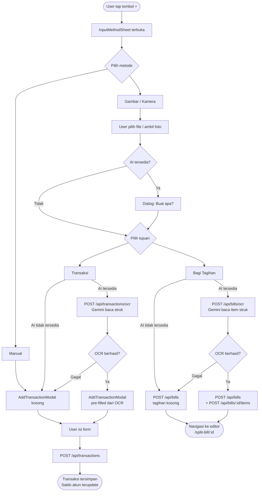
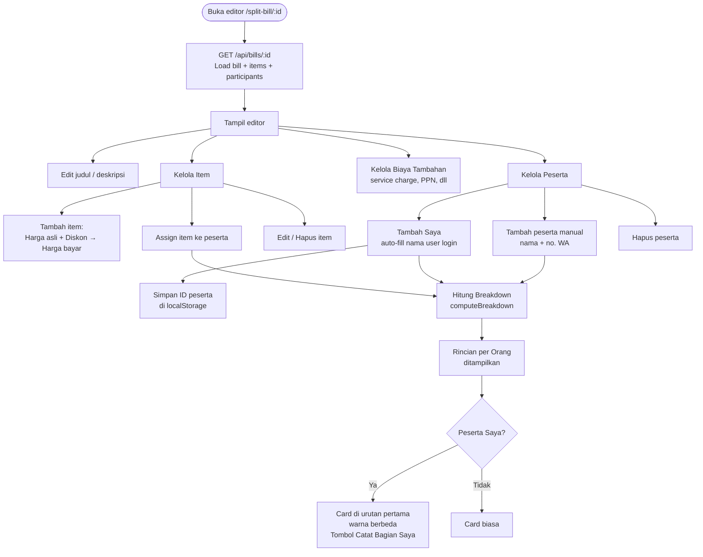
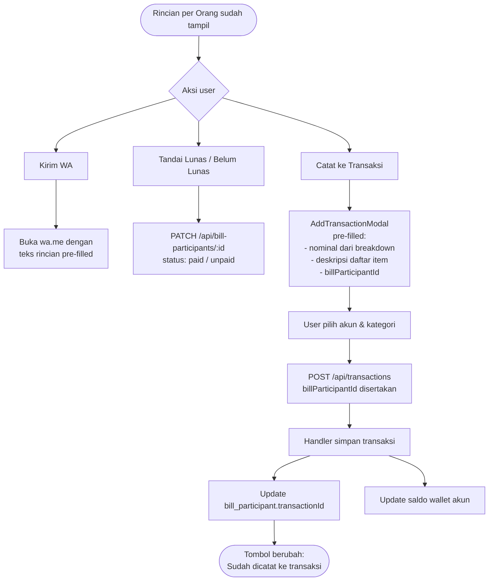
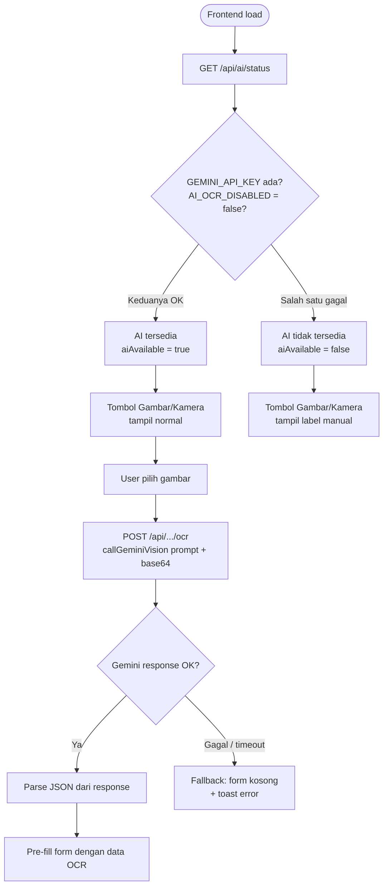
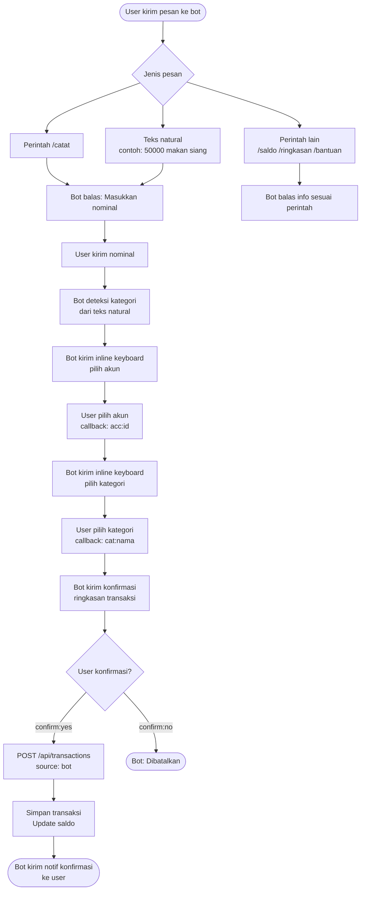
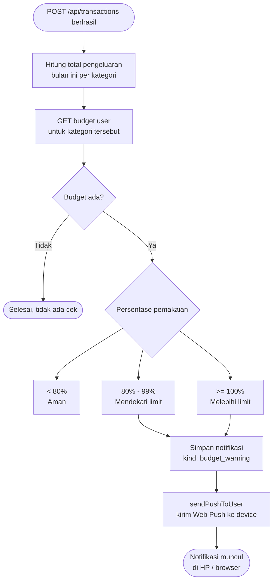
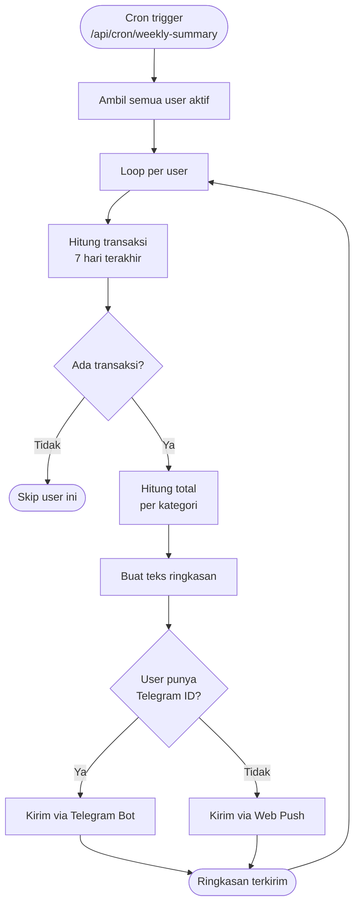

# MoneyNote — Functional Flow Diagrams

> Diagram alur per fitur. Dibaca dari atas ke bawah.  
> Render otomatis di GitHub, VS Code (Mermaid extension), dan GitLab.

---

## 1. Input Transaksi (Tombol +)

---

## 2. Split Bill — Buat & Edit

---

## 3. Split Bill — Distribusi & Sync

---

## 4. AI OCR — Status & Fallback

---

## 5. Telegram Bot — Catat Transaksi

---

## 6. Budget — Warning & Notifikasi

---

## 7. Ringkasan Mingguan (Cron)

