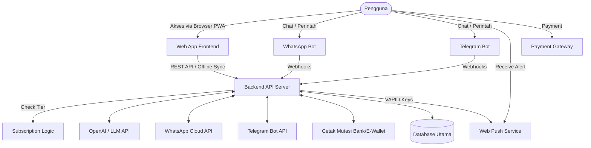
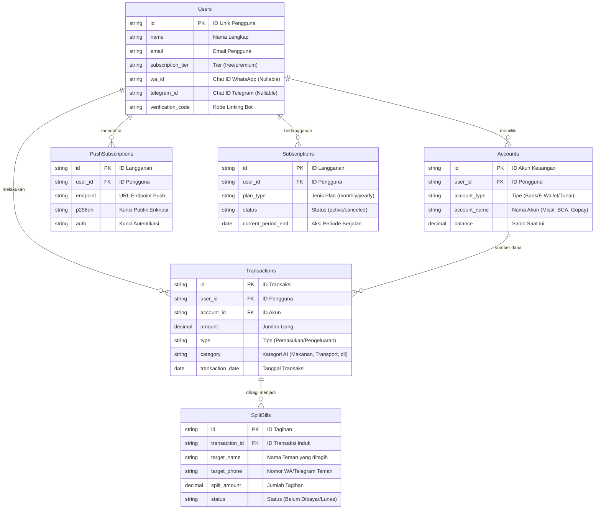

# PRD — Project Requirements Document

## 1. Overview
Aplikasi ini adalah asisten keuangan pribadi cerdas yang dirancang untuk mengatasi kerumitan pencatatan finansial manual. Tujuan utama dari aplikasi ini adalah memberikan kemudahan maksimal kepada pengguna perorangan melalui integrasi multi-channel (WhatsApp, Telegram, dan Web Push Notification) sehingga aktivitas pencatatan dan monitoring bisa dilakukan tanpa harus selalu membuka aplikasi. 

Aplikasi mengadopsi model bisnis **Freemium** untuk menurunkan hambatan masuk pengguna, di mana fitur dasar tersedia secara gratis secara permanen, sedangkan fitur lanjutan tersedia melalui berlangganan. Aplikasi dirancang responsif untuk semua perangkat web (PC, Laptop, Tablet, HP), memiliki kemampuan sinkronisasi saat offline, dan mengadopsi arsitektur yang kedepannya mudah diubah menjadi aplikasi _native_ (Android/iOS).

## 2. Requirements
- **Target Pengguna:** Perorangan (individu) yang ingin mengelola keuangan pribadi dengan mudah.
- **Model Bisnis:** **Freemium**. 
  - **Gratis:** Akses seumur hidup untuk fitur dasar (Telegram Bot, Input Manual, Web Push, Basic AI).
  - **Premium:** Berlangganan bulanan/tahunan untuk fitur lanjut (WhatsApp Bot, Auto Bank Sync, Deep AI Insights).
- **Waktu Pengerjaan:** 2 Bulan (untuk peluncuran versi awal/MVP).
- **Keamanan:** Sangat Krusial. Data keuangan harus dienkripsi dengan baik dan mematuhi regulasi privasi data.
- **Ketersediaan Offline:** Pengguna dapat memasukkan data saat tidak ada internet, dan sistem akan melakukan sinkronisasi otomatis ketika koneksi kembali tersedia.
- **Kesiapan Skalabilitas:** Arsitektur API harus dipisah secara logis agar di masa depan dapat dikonsumsi oleh aplikasi _native_ (Android/iOS).
- **Efisiensi Biaya Komunikasi:** Menggunakan Telegram Bot sebagai saluran utama untuk pengguna Gratis (karena API gratis) untuk menekan biaya operasional, sambil mempertahankan WhatsApp untuk pengguna Premium yang preferen.
- **Notifikasi Real-time:** Implementasi Web Push Notification untuk alert penting tanpa bergantung sepenuhnya pada aplikasi chat pihak ketiga (tersedia untuk semua tier).
- **Manajemen Langganan:** Sistem harus mampu membatasi akses fitur berdasarkan status langganan pengguna secara real-time.

## 3. Core Features
- **Integrasi Chat Bot (Tiered):**
  - **[Gratis] Telegram Bot:** Pengguna dapat mencatat pengeluaran via chat, memperoleh ringkasan keuangan mingguan/bulanan, dan notifikasi dasar melalui Telegram.
  - **[Premium] WhatsApp Bot:** Fitur sama dengan Telegram namun melalui WhatsApp Cloud API untuk pengguna yang lebih preferen kenyamanan WhatsApp.
- **Wawasan Keuangan Berbasis AI (AI Insights):**
  - **[Gratis] Basic Categorization:** AI otomatis mengkategorikan transaksi dari chat (misal: "makan siang 50rb" -> Kategori: Makanan).
  - **[Premium] Deep Insights:** Analisis pola pengeluaran mendalam, saran penghematan personal, dan peringatan prediktif jika pengeluaran mendekati batas anggaran berdasarkan historis.
- **Notifikasi Push Web (Web Push):**
  - **[Gratis] Standard Alert:** Pengingat tagihan dan konfirmasi transaksi langsung di browser/device pengguna.
  - **[Premium] Priority Alert:** Notifikasi kritis (seperti deteksi transaksi mencurigakan atau batas anggaran hampir habis) dengan prioritas tinggi.
- **Fitur Sinkronisasi Offline:** Aplikasi web berbasis PWA (_Progressive Web App_) yang menyimpan riwayat sementara di perangkat pengguna (Local Storage/IndexedDB) saat offline, lalu mengirimkannya ke server saat online.
- **Koneksi Multi-Sumber:**
  - **[Gratis] Manual & Import:** Input manual dan impor file Excel/CSV.
  - **[Premium] Auto Bank Sync:** Kemampuan menarik data transaksi secara otomatis dari Bank dan E-Wallet terhubung (memerlukan biaya pihak ketiga).
- **Manajemen Berbagi Tagihan (_Split Bill_):**
  - **[Gratis] Basic Split:** Menghitung porsi pembayaran dan membuat pesan teks tagihan.
  - **[Premium] Auto Track:** Melacak status pembayaran teman secara otomatis melalui integrasi chat dan pengingatan otomatis bagi yang belum bayar.

## 4. User Flow
1. **Pendaftaran & Integrasi:** 
   - Pengguna mendaftar melalui Website (Next.js) menggunakan Better Auth (mendukung Email/Password, Social Login, atau Magic Link).
   - Setelah login, pengguna diarahkan ke dashboard untuk menghubungkan akun bot.
   - Pengguna memilih channel preferensi (Telegram [Gratis] atau WhatsApp [Premium]).
   - Sistem menampilkan kode unik verifikasi. Pengguna mengirimkan kode tersebut ke Bot untuk mengaitkan (link) akun Web mereka dengan identitas Chat ID mereka.
2. **Pencatatan Harian:**
   - *Opsi 1:* Pengguna mencatat transaksi melalui dashboard web.
   - *Opsi 2:* Pengguna mengirim pesan ke Bot (Telegram/WA) dan AI otomatis mengkategorikannya.
   - *Opsi 3:* Notifikasi Push Web muncul sebagai pengingat input jika belum ada transaksi hari itu.
   - *Constraint:* Jika pengguna Gratis mencoba mengakses fitur WhatsApp, sistem akan menampilkan prompt upgrade.
3. **Manajemen Langganan (Upgrade):**
   - Pengguna dapat mengakses halaman "Upgrade" di dashboard.
   - Sistem menampilkan perbandingan fitur Free vs Premium.
   - Pengguna melakukan pembayaran melalui Payment Gateway.
   - Status akun diperbarui secara instan, membuka akses ke fitur Premium.
4. **Membagi Tagihan:** 
   - Pengguna memilih sebuah transaksi di aplikasi, memilih opsi "Split Bill", memasukkan nama teman-teman.
   - Aplikasi mengirimkan pesan tagihan ke channel chat sesuai izin akses tier pengguna.
5. **Mendapatkan Wawasan & Notifikasi:** 
   - Setiap akhir minggu, Bot mengirimkan ringkasan keuangan otomatis.
   - Web Push Notification mengirimkan alert real-time jika batas anggaran harian hampir tercapai.
   - Pengguna Premium mendapatkan laporan analitik mendalam di dashboard visual.

## 5. Architecture
Aplikasi ini menggunakan pendekatan pemisahan antara Frontend (Tampilan Web) dan Backend (Logika & API). Pendekatan ini memastikan Backend yang sama kelak bisa digunakan untuk aplikasi Android/iOS. Arsitektur kini mendukung multi-channel messaging, push notification, dan manajemen tier langganan.

## 6. Database Schema
Berikut adalah struktur dasar penyimpanan data yang dibutuhkan oleh sistem. Diperbarui untuk mendukung identifikasi multi-channel, langganan push notification, dan tingkatan langganan (Freemium).

### Tabel Utama:
- **Users:** Menyimpan data pengguna, status langganan (tier), dan identitas terikat (WA/Telegram).
- **Accounts:** Dompet, rekening bank, atau e-wallet milik pengguna.
- **Transactions:** Riwayat pemasukan dan pengeluaran.
- **SplitBills:** Data tagihan patungan yang terkait dengan suatu transaksi.
- **PushSubscriptions:** Menyimpan endpoint untuk Web Push Notification per device pengguna.
- **Subscriptions:** Menyimpan riwayat langganan dan status pembayaran.

## 7. Tech Stack
Teknologi yang dipilih di bawah ini adalah ekosistem yang paling stabil, _open-source_, dan memiliki literatur/referensi terbanyak di internet. Hal ini sangat penting agar AI generator (seperti Cursor/Copilot) tidak kebingungan dan meminimalisir *error/hallucination* saat proses pembuatan kode.

- **Framework Full Stack:** **Next.js (App Router)**. Sangat populer, stabil, dan bisa menangani Frontend sekaligus Backend API dalam satu proyek yang rapi.
- **Styling & UI Components:** **Tailwind CSS + shadcn/ui**. Standar industri saat ini. Membuat tampilan responsif dari PC hingga HP sangat mudah dan didukung sempurna oleh AI.
- **Database & ORM:** **SQLite (via TursoDB)** dikombinasikan dengan **Drizzle ORM**.
  - *Kenapa Turso/SQLite:* Sangat memfasilitasi kebutuhan **fitur sinkronisasi saat offline**. Database lokal dapat menyimpan riwayat saat tak ada internet, lalu otomatis disinkronisasikan ke database utama Turso di server saat terhubung kembali.
  - *Kenapa Drizzle:* ORM paling stabil untuk TypeScript saat ini, eksekusi sangat cepat, dan sangat disukai AI karena sintaksnya yang tegas.
- **Autentikasi (Keamanan Krusial):** **Better Auth**. Library _open-source_ terbaru yang aman, modern, dan sangat mudah diintegrasikan dengan Drizzle & Next.js.
- **Payment Gateway:** **Midtrans / Stripe**. Untuk menangani pembayaran langganan Premium secara otomatis dan aman.
- **Integrasi Eksternal:**
  - **AI Engine:** OpenAI API (untuk mengkategorikan transaksi dari chat secara otomatis & memberikan _insight_). Penggunaan dibatasi untuk tier Free dan diperluas untuk tier Premium.
  - **WhatsApp Bot:** WhatsApp Cloud API (Resmi dari Meta) - **Khusus Pengguna Premium** karena memiliki biaya operasional per-konversi.
  - **Telegram Bot:** Telegram Bot API (Gratis) - **Saluran Utama Pengguna Gratis** untuk efisiensi biaya operasional maksimal.
  - **Web Push Notification:** **Web Push API** (menggunakan library `web-push` dengan VAPID Keys) untuk mengirim notifikasi langsung ke browser/PWA pengguna tanpa bergantung pada pihak ketiga.
  - **PWA (Progressive Web App):** Kustom Service Workers agar aplikasi web bisa di-install di HP selayaknya aplikasi *native*, mendukung fitur offline dan push notification.